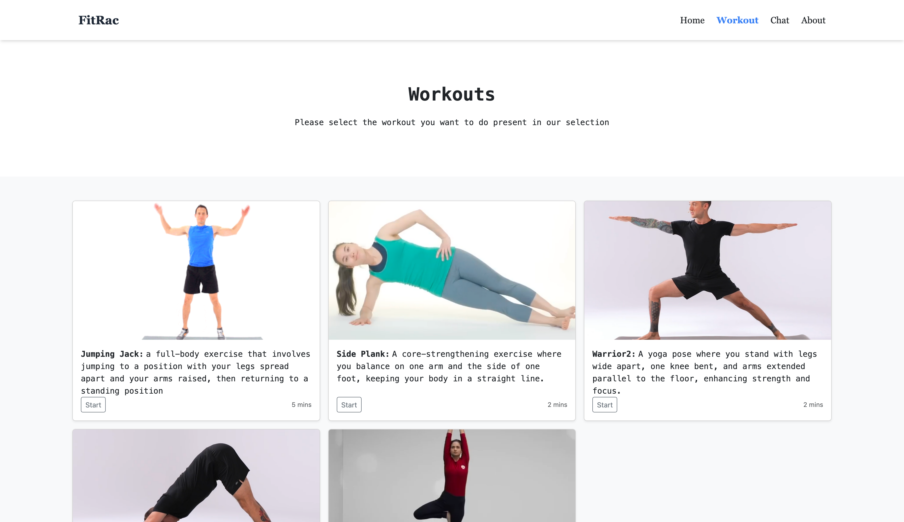
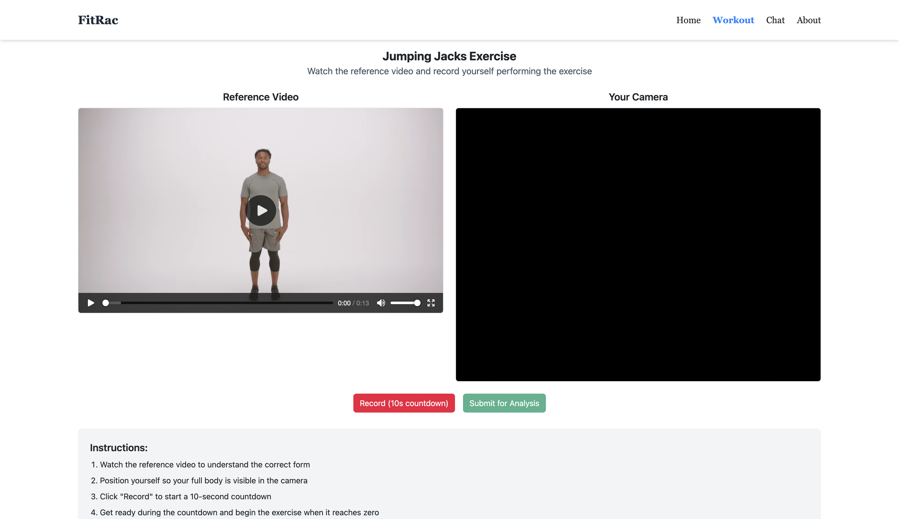
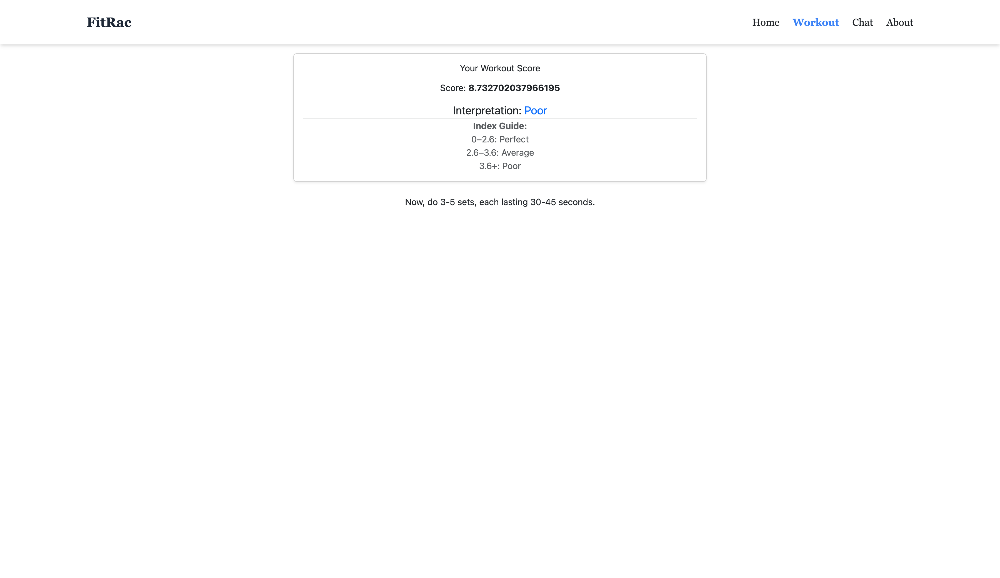

# Workout Form Analysis Assistant

An interactive web application that helps users improve their exercise form by analyzing recorded videos using AI-powered pose detection. The application compares your exercise form against reference workouts and provides quantitative feedback on your performance.

## Application Flow

<p align="center">
  
  <br>
  <em>Homepage - The entry point to the application</em>
</p>

<p align="center">
  
  <br>
  <em>Workout Selection - Choose from available exercises</em>
</p>

<p align="center">
  
  <br>
  <em>Workout Page - Watch reference video and record your performance</em>
</p>

<p align="center">
  
  <br>
  <em>Result Page - View your form analysis score</em>
</p>

## Features

- **Real-time Video Recording**: Record yourself performing exercises directly in your browser
- **AI-Powered Analysis**: Advanced pose detection analyzes your form against reference exercises
- **Instant Feedback**: Receive immediate analysis of your form
- **User-Friendly Interface**: Clean, responsive design works on desktop and mobile devices

## Installation

### Prerequisites

- Python 3.9 recommended
- pip
- FFmpeg (for video processing)

### Setup

1. Clone the repository

```bash
git clone https://github.com/RohanSatram/WorkoutAssistant.git
cd WorkoutAssistant
```

2. Create and activate a virtual environment

```bash
python -m venv venv
source venv/bin/activate  # On Windows use: venv\Scripts\activate
```

3. Install dependencies

```bash
pip install -r requirements.txt
```

4. Run the application

```bash
python app.py
```

5. Open your browser and navigate to `http://localhost:5001`

## Usage

1. Select a workout from the available options
2. Watch the reference video to understand correct form
3. Position yourself in view of your camera
4. Click "Record" and wait for the 10-second countdown
5. Perform the exercise when recording starts
6. View your form analysis results

## Adding Your Own Workouts

You can add your own custom workouts:

1. **Reference Videos**:

   - Find a high-quality video of the exercise with clear visibility of the whole body
   - Save the video in MP4 format

2. **Add to Reference Library**:

   - Place your video file in the `static/videos/WorkoutVideos/` directory
   - Use a descriptive name for the file (e.g., `squat.mp4`)

3. **Create Template Files**:

   - Duplicate an existing template from `templates/` (e.g., copy `jumpingjacks.html` to `squat.html`)
   - Update the HTML title, description, and video source path

4. **Update Routes in app.py**:

   - Add new route functions for your workout and its result page
   - Follow the pattern of existing routes (e.g., `/squat` and `/squatresult`)

5. **Add to Workout Menu**:
   - Update `templates/workouts.html` to include your new exercise

## How It Works

It uses TensorFlow's MoveNet model for human pose detection. When you submit a video:

1. Your exercise video is captured
2. The video is processed to extract key body points
3. Dynamic Time Warping (DTW) measures similarity with the reference exercise
4. Results are displayed as a percentage match score

## Technology Stack

- **Backend**: Flask (Python)
- **Frontend**: HTML, CSS, JavaScript, Bootstrap, Tailwind CSS
- **AI/ML**: TensorFlow, MoveNet
- **Video Processing**: MoviePy, FFmpeg

## Contributing

Contributions are welcome! Please feel free to submit a Pull Request.
